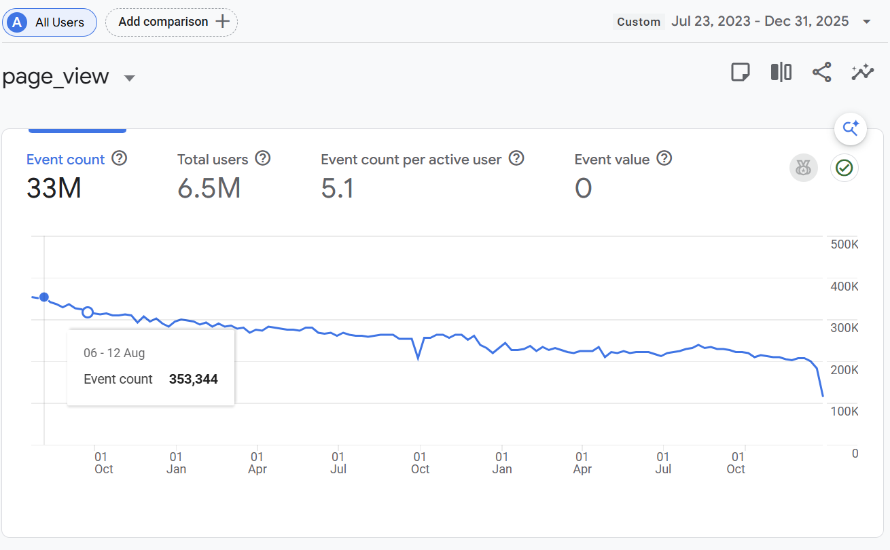
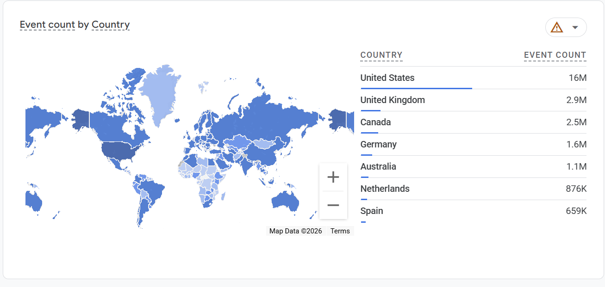
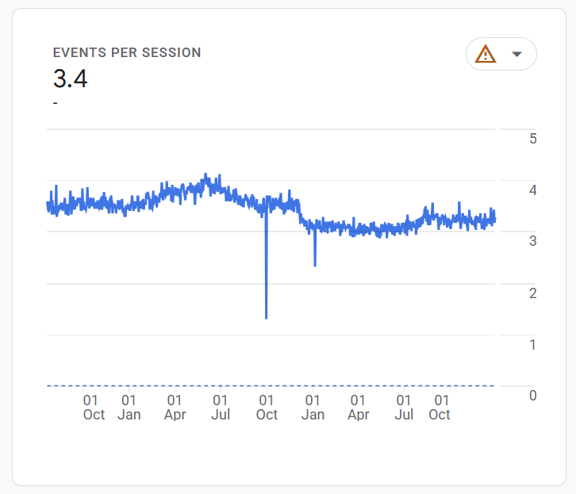

# Metrics, analytics, numbers, etc

A lot of the analytics data is gone from various Google Analytics migrations and
retention policies, I have some data from summary Google Analytics emails, and
some recent data. Like this chart of July 2023 through the end of 2025:

33 million page views. 6.5 million people.

Half the traffic was American, but there were 876,000 page views from the
Netherlands and 659,000 from Spain.

